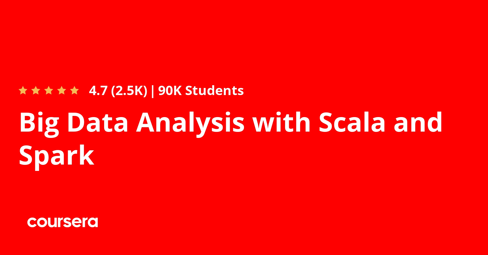

# Big Data Analysis with Scala and Spark (Coursera)

This repository contains my submitted assignments for the Coursera MOOC [Big Data Analysis with Scala and Spark](https://www.coursera.org/learn/scala-spark-big-data/), given by École Polytechnique Fédérale de Lausanne (EPFL), and taught by Prof. Heather C. Miller.

## About this course

Manipulating big data distributed over a cluster using functional concepts is rampant in industry, and is arguably one of the first widespread industrial uses of functional ideas. This is evidenced by the popularity of MapReduce and Hadoop, and most recently Apache Spark, a fast, in-memory distributed collections framework written in Scala. In this course, we'll see how the data parallel paradigm can be extended to the distributed case, using Spark throughout. We'll cover Spark's programming model in detail, being careful to understand how and when it differs from familiar programming models, like shared-memory parallel collections or sequential Scala collections. Through hands-on examples in Spark and Scala, we'll learn when important issues related to distribution like latency and network communication should be considered and how they can be addressed effectively for improved performance.

Learning Outcomes. By the end of this course you will be able to:

- read data from persistent storage and load it into Apache Spark,
- manipulate data with Spark and Scala,
- express algorithms for data analysis in a functional style, 
- recognize how to avoid shuffles and recomputation in Spark,

Recommended background: You should have at least one year programming experience. Proficiency with Java or C# is ideal, but experience with other languages such as C/C++, Python, Javascript or Ruby is also sufficient. You should have some familiarity using the command line. This course is intended to be taken after Parallel Programming: [https://www.coursera.org/learn/parprog1](https://www.coursera.org/learn/parprog1).

## Timeline

* **Date Started**: Jan 4, 2022

* **Date Completed**: Jan 10, 2022

## Assignments

### Practice Programming Assignment: Example

* **Week**: 1
  
* **Lesson**: Using the Scala REPL, Using SBT tool
  
* **Description**: "The goal of this assignment is to familiarize yourself with the infrastructure and the tools required during this class. Even though the grade in this assignment will be excluded from your final grade for the course, it is important that you work through this assignment carefully."

* **Grade**: 10 / 10

### Programming Assignment 1: Wikipedia

* **Week**: 1

* **Lesson**: Basics of Spark's RDDs

* **Description**: "In this assignment, we'll use our full-text data from Wikipedia to produce a rudimentary metric of how popular a programming language is, in an effort to see if our Wikipedia-based rankings bear any relation to the popular Red Monk rankings."

* **Grade**: 10 / 10

### Programming Assignment 2: StackOverflow

* **Week**: 2 (two-week long assignment)

* **Lesson**: Reduction Operations & Distributed Key-Value Pairs

* **Description**: "The overall goal of this assignment is to implement a distributed k-means algorithm which clusters posts on the popular question-answer platform StackOverflow according to their score. Moreover, this clustering should be executed in parallel for different programming languages, and the results should be compared."

* **Grade**: 10 / 10

### Programming Assignment 3: Time Usage

* **Week**: 4

* **Lesson**: SQL, Dataframes, and Datasets

* **Description**: "Our goal is to identify three groups of activities: primary needs (sleeping and eating), work, other (leisure). And then to observe how do people allocate their time between these three kinds of activities, and if we can see differences between men and women, employed and unemployed people, and young (less than 22 years old), active (between 22 and 55 years old) and elder people."

* **Grade**: 10 / 10

## Note

Resource files have to be unzipped for the code to work.